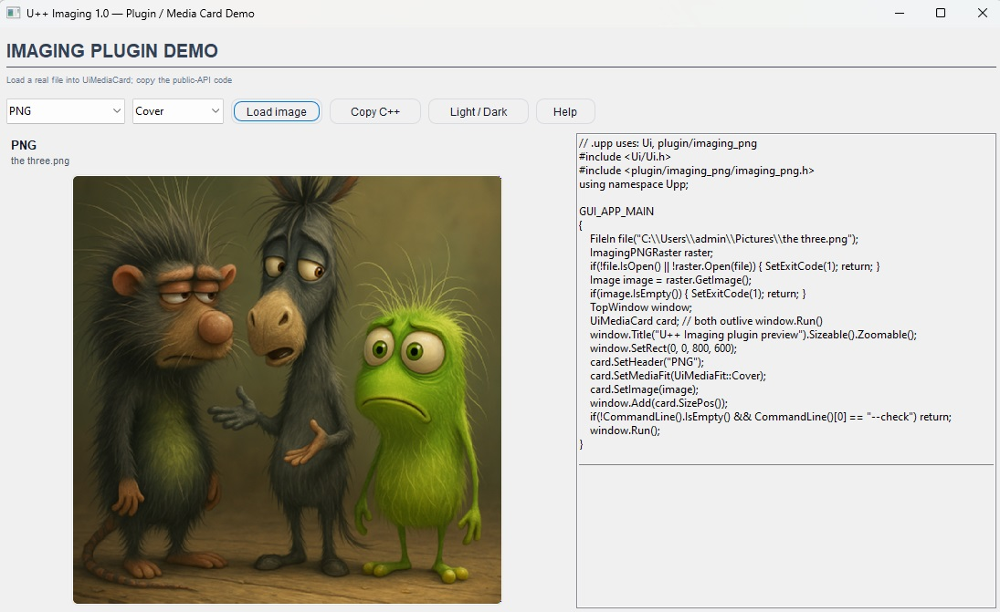
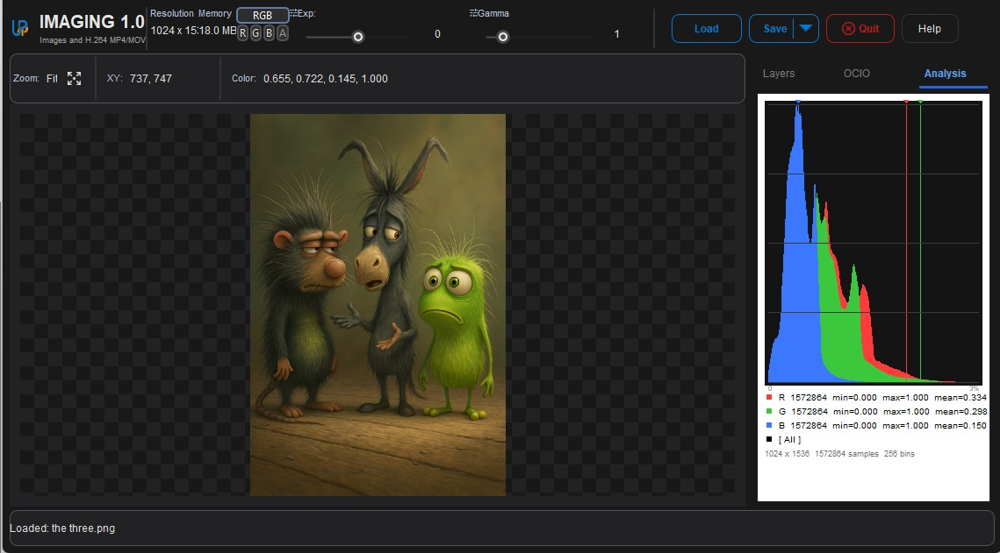

# upp_imaging

Version 1.0: a U++ imaging framework with opt-in image-format plugins, a Workbench and a bounded H.264 video reader for trusted local files.

## In use

The plugin demo loads an image into `UiMediaCard` and shows the matching C++ to copy into your application.

The Workbench provides image viewing, channel controls, exposure, colour transforms and histogram analysis.

## Choose an API

| Need | Package |
| --- | --- |
| Typed image data and metadata | `ImagingCore` |
| Full-fidelity image loading and transactional saving | `ImagingIO` |
| Color configuration and transforms | `ImagingColor` |
| Statistics and histograms | `ImagingAnalysis` |
| Comparisons and structured diagnostics | `ImagingDiagnostics` |
| Framework umbrella | `Imaging` |
| Direct native APIs | `OpenImageIO`, `OpenColorIO`, `openexr`, `openexr_core`, and the public codec packages |
| Display-oriented U++ StreamRaster bridge | `plugin/imaging_jpeg`, `plugin/imaging_png`, `plugin/imaging_jxl`, `plugin/imaging_hdr`, `plugin/imaging_dpx`, `plugin/exr` |
| Bounded H.264/MP4 decode-to-RGBA | `FFmpeg` |

ImagingIO supports EXR, PNG, JPEG, JPEG XL, HDR/RGBE, DPX/Cineon, camera RAW, WebP, HEIF/AVIF and TIFF within each format's declared policy. RAW, HEIF/AVIF and Cineon are input-only. JPEG is also available through the direct codec API. Framework public headers do not expose OpenImageIO or OpenColorIO types.

## Browse and build

Our framework is in [imaging](imaging/), native dependencies in [third_party](third_party/), U++ adapters in [integrations](integrations/), and ImagingWorkbench in [apps](apps/). Tests, examples, tools and documentation have their own directories.

1. Initialize the pinned submodules with `git submodule update --init --recursive`.
2. Configure the active `GitHubOut` assembly from [GitHubOut.var.example](GitHubOut.var.example), using local absolute nest paths and an absolute `OUTPUT` path ending in `build/windows-x64/umk`. Existing local assembly files are not updated by pulling Git.
3. On Windows, build/run a focused test with `powershell -ExecutionPolicy Bypass -File tools/validate.ps1 -Package imaging_io_test`. Omit `-Package` for the retained Debug/Release suite; use `-Umk` to override the builder path.
4. Follow [build and run](docs/BUILD_AND_RUN.md) to stage ImagingWorkbench under `build/` and publish a verified Release executable to `bin/windows-x64/ImagingWorkbench.exe`.

See [current documentation](docs/README.md), [supported formats](docs/FORMATS.md), [U++ usage](docs/FORMAT_QUICKSTART.md) and [architecture](docs/ARCHITECTURE.md). Compiler/test/log output belongs under build; bin contains verified runnable Release applications and their payloads.

The FFmpeg stack remains pinned to `n9.0.2`, scalar/static, native H.264 decode, MOV/MP4 demux, local-file protocol and swscale. Networking, external codecs, hardware acceleration, encoding and other media subsystems remain disabled.

[THIRD_PARTY.md](THIRD_PARTY.md) records dependency provenance; [LICENSES.md](LICENSES.md) lists licences. [Input restrictions](docs/INPUT_POLICY.md) define the supported trust boundary. [Maintainer notes](docs/MAINTAINING.md) describe folder/package ownership and future extensions.

## Version 1.0 Windows release

The Workbench lists each image family and H.264 MP4/MOV explicitly. It exports EXR, PNG, JPEG, JPEG XL, TIFF, WebP, Radiance HDR and DPX. Help is available through the Help button or F1.

[ImagingPluginDemo](apps/ImagingPluginDemo/) loads JPEG, PNG, JPEG XL, EXR, HDR and DPX into `UiMediaCard`, with live C++ output and Copy C++. Start with the [plugin quick start](docs/FORMAT_QUICKSTART.md); add the selected plugin to your `.upp` uses and call `SetImage` with its decoded U++ image. Full-fidelity HDR data uses `ImagingIO`.

See [version 1 release evidence](docs/V1_RELEASE.md) for executable identities and validation. Support is Windows x64, trusted local inputs with [enforced limits](docs/INPUT_POLICY.md). MP4/MOV requires H.264 and plays without audio. JPEG XR, other video codecs, HDR video, Linux/macOS, sanitizers and fuzz validation remain deferred; the release does not claim those capabilities.
